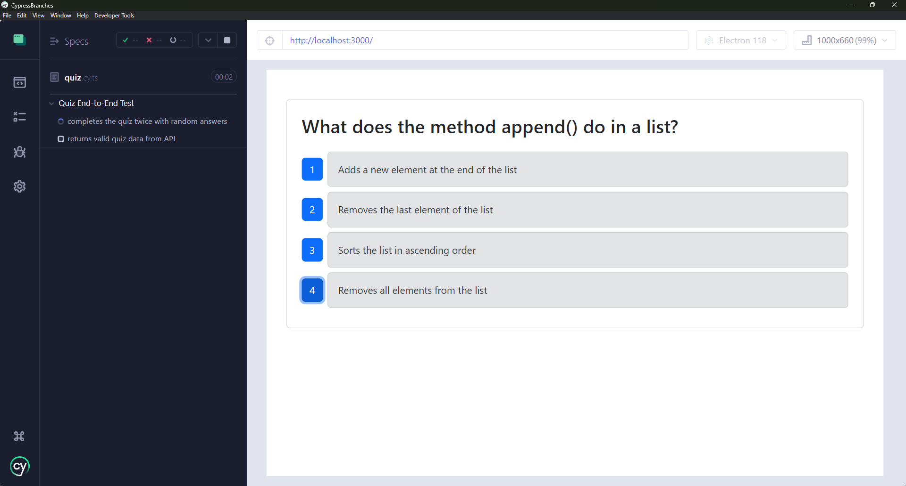

# CypressBranches
 This project integrates [Cypress](https://www.cypress.io/) for both component and end-to-end testing into an existing quiz application. The application, built using the MERN stack (MongoDB, Express.js, React, Node.js), allows users to take a tech quiz, view random questions, and see their score at the end.

## Features
- **Component Testing**: Verifies individual Quiz component, ensuring it functions correctly in isolation.
- **End-to-End Testing**: Simulates the full user journey from starting the quiz to viewing the final score, ensuring the app works as intended.

## Table of Contents
 - [Installation](#installation)
 - [Usage](#usage)
 - [Credits](#credits)
 - [License](#license)
 - [Badges](#badges)
 - [Tests](#tests)
 - [Questions](#questions)

## [Installation](#installation)
  1. Clone this repo locally;
  2. Validate you have MongoDB installed locally; 
  3. Create a .env with `mongodb://127.0.0.1:27017/techquiz`;
  4. Install dependencies by running `npm i` in your terminal from the root; 
  5. Run build with `npm run build`;
  6. Run dev with `npm run start:dev`;
  7. Your web browser should open to `http://localhost:3000/`; and
  8. See [Usage](#usage) or [Tests](#tests) for more details.

  ## [Usage](#usage)
  View a demo of the application testing here: [Youtube Demo Video](https://youtube.com/playlist?list=PLp5-kLRcKJPc3IzxO8tBtEfKaW1WGHQDz&si=aK35KC8E2BCAHJFF).
  1. Click `Start Quiz`;
  2. Read the question and select the number button for your answer;
  3. Repeat for each question in the database;
  4. Review your score on the final screen;
  5. Select `Take New Quiz` on the final screen, as desired; and
  6. Close out web browser when finished.
  
  ### Application Screenshot
  

  ## [Credits](#credits)
  - [bootstrap](https://getbootstrap.com/)
  - [dotenv](https://www.npmjs.com/package/dotenv)
  - [express](https://expressjs.com/)
  - [MongoDB](https://www.mongodb.com/)
  - [mongoose](https://mongoosejs.com/)
  - [React](https://react.dev/)
   - In Dev
      - [concurrently](https://www.npmjs.com/package/concurrently)
      - [cypress](https://www.cypress.io/)
      - [nodemon](https://nodemon.io/)
      - [vite](https://vite.dev/)
      - [vitest](https://vitest.dev/)
      - [wait-on](https://www.npmjs.com/package/wait-on)
  
  ## [License](#license)
  This project is licensed under the MIT - see the [LICENSE](LICENSE) file for details.

  ## [Badges](#badges)
  

  ## [Tests](#tests)
   1. Follow [Installation](#installation) and run application locally.
   2. For headless, you can run the following scripts
        1. `npm run test:e2e` to run the end to end tests; 
        2. `npm run test:component` the run the component tests;
        3. `npm run test:all` to run both end to end and component tests;
   3. To use the Cypres GUI - run `npm run test-gui`
        1. Select E2E or Component Testing; 
        2. Select desired browser or use Electron as default;
        3. Select Start Testing; 
        4. Select testing file and test will run automatically;
        5. Select Specs to go back to other test type (i.e. E2E specs)
        6. Select the test file to run and test will run automatically; 

  ## [Questions](#questions)
  If you have any questions, please feel free to reach out to me at musserdn@gmail.com or visit my [GitHub Profile](https://github.com/musserdn/).